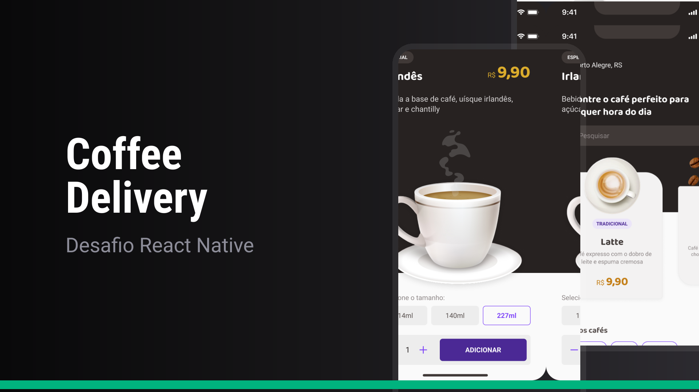

<h1 align="center">
   Coffee Delivery Mobile
</h1> 

<div align="center">
  <b>
    <a href="#-Technologies"><b>Technologies</b></a>&nbsp;&nbsp;&nbsp;|&nbsp;&nbsp;&nbsp;
    <a href="#-Project"><b>Project</b></a>&nbsp;&nbsp;&nbsp;|&nbsp;&nbsp;&nbsp;
    <a href="#-Layout"><b>Layout</b></a>&nbsp;&nbsp;&nbsp;
  </b>  
</div>

---

<div align="center">
   
    
</div> 

</br>

## 🚀 Getting started

Clone the project and access the folder.

```bash
# Clone the project
$ git clone https://github.com/diaspd/coffee-delivery-mobile.git

# Install the dependencies
$ npm install

# Start the application
$ npx expo start -c

```
</br>

## 💻 Technologies

This project was developed with the following technologies:
<b>
- React Native
- Type Script
- Expo
- Skia
- React Native Gesture Handler
</b>

</br>

## 📄 Project
💰 A project with a lot of animations like splash screen, to add coffees to cart, finish screen and more.

<br></br>

## 🔖 Layout
- [Coffee Delivery Mobile - Figma](https://www.figma.com/community/file/1245817631079079109/coffee-delivery-desafio-react-native)

<br></br>

Made with ♥ by Pedro Dias. 👋 Follow me on social media! </br>

If you can give a little star, I appreciate it 🤩
